# Demo-Credit

## Overview

Demo-Credit is a backend service for a simple wallet and money transfer system. It provides user registration/login, wallet creation, funded balance management, withdrawals, peer-to-peer transfers, transaction history, and idempotent request handling.

Key architectural principles:
- Single wallet per user
- Transaction ledger for funds, withdrawals, and transfers
- Idempotent payment operations to avoid duplicate side effects
- JWT-based authorization for protected wallet and transaction routes
- External blacklist verification during registration

## Stack

- Node.js + Express
- TypeScript
- MySQL via Knex
- JWT authentication
- Zod validation
- Supertest + Jest integration tests
- UUID primary keys

## Architecture

The application is organized by domain modules:
- `src/modules/auth` — registration, login, user lookup
- `src/modules/wallet` — wallet retrieval, funding, withdrawal, sending money
- `src/modules/transactions` — transaction and transfer history
- `src/modules/idempotency` — idempotency key storage and replay logic
- `src/middlewares` — authentication, validation, error handling
- `src/config` — database connection

## Entity-Relationship Diagram



> The SVG above (`demo-credit-erd.svg`) was generated from the Mermaid source used during design. If you prefer the raw Mermaid source, see the block below.

```mermaid
erDiagram
    USERS ||--o{ WALLETS : owns
    WALLETS ||--o{ TRANSACTIONS : records
    WALLETS ||--o{ TRANSFERS_SENT : sends
    WALLETS ||--o{ TRANSFERS_RECEIVED : receives
    USERS ||--o{ IDEMPOTENCY_KEYS : owns

    USERS {
      uuid id PK
      string first_name
      string last_name
      string email unique
      string password
      timestamp created_at
      timestamp updated_at
    }

    WALLETS {
      uuid id PK
      uuid user_id FK
      decimal balance
      timestamp created_at
      timestamp updated_at
    }

    TRANSACTIONS {
      uuid id PK
      uuid wallet_id FK
      enum type
      decimal amount
      enum status
      string reference
      text description
      timestamp created_at
      timestamp updated_at
    }

    TRANSFERS {
      uuid id PK
      uuid sender_wallet_id FK
      uuid receiver_wallet_id FK
      decimal amount
      string reference unique
      timestamp created_at
      timestamp updated_at
    }

    IDEMPOTENCY_KEYS {
      uuid id PK
      string key unique
      uuid user_id FK
      string endpoint
      enum status
      json response
      text error_message
      timestamp created_at
      timestamp updated_at
    }
```

## Data Model

### Users
- `id` — UUID primary key
- `first_name`, `last_name`
- `email` — unique login identifier
- `password` — hashed password
- timestamps

### Wallets
- `id` — UUID primary key
- `user_id` — unique foreign key to `users.id`
- `balance` — decimal with two decimal places
- timestamps

### Transactions
- `id` — UUID primary key
- `wallet_id` — foreign key to `wallets.id`
- `type` — `FUND`, `WITHDRAW`, `TRANSFER_IN`, `TRANSFER_OUT`
- `amount` — decimal; positive for credits and negative for debits as appropriate
- `status` — `PENDING`, `SUCCESS`, or `FAILED`
- `reference` — ledger reference string
- `description`
- timestamps

### Transfers
- `id` — UUID primary key
- `sender_wallet_id` — sending wallet foreign key
- `receiver_wallet_id` — receiving wallet foreign key
- `amount`
- `reference` — unique transfer reference
- timestamps

### Idempotency Keys
- `id` — UUID primary key
- `key` — unique idempotency token header value
- `user_id` — foreign key to `users.id`
- `endpoint` — logical request name
- `status` — request state
- `response` — stored JSON payload for replay
- `error_message`
- timestamps

## API Design

Base path: `/api/v1`

### Authentication

- `POST /auth/register`
  - Validates registration payload
  - Checks external karma blacklist
  - Creates user and wallet together
  - Returns JWT token and user details

- `POST /auth/login`
  - Validates login payload
  - Verifies credentials
  - Returns JWT token and user details

- `GET /auth/:user_id/me`
  - Protected
  - Returns user profile and wallet balance

### Wallet

- `GET /wallet/:user_id`
  - Protected
  - Returns wallet details and current balance

- `POST /wallet/:user_id`
  - Protected
  - Requires `Idempotency-Key` header
  - Funds the wallet
  - Creates a `FUND` transaction

- `POST /wallet/:user_id/withdraw`
  - Protected
  - Requires `Idempotency-Key` header
  - Withdraws funds from the wallet
  - Creates a `WITHDRAW` transaction

- `POST /wallet/send`
  - Protected
  - Requires `Idempotency-Key` header
  - Sends money from authenticated user to a receiver by email
  - Creates `TRANSFER_OUT` and `TRANSFER_IN` transactions plus a transfer record

### Transaction History

- `GET /transactions/:user_id`
  - Protected
  - Returns all transactions for the user wallet

- `GET /transactions/:user_id/transfers`
  - Protected
  - Returns transfer records where the user is the sender

## Security and Validation

- JWT protects all user-specific wallet and transaction endpoints
- Request validation is implemented with Zod schemas
- Sensitive operations require `Idempotency-Key`
- Registration checks an external user blacklist before allowing account creation

## Idempotency and Stability

Idempotency keys are stored in `idempotency_keys` to prevent duplicate side effects for:
- wallet funding
- wallet withdrawal
- peer-to-peer transfers

Stored responses are replayed when the same key is reused for the same user and endpoint. That design ensures safe retries and reduces duplicate ledger entries.

## Setup

1. Copy `.env.example` or create a `.env` with:
   - `DB_HOST`
   - `DB_PORT`
   - `DB_USER`
   - `DB_PASSWORD`
   - `DB_NAME`
   - `JWT_SECRET`
   - `ADJUTOR_API_KEY`

2. Install dependencies:
   ```bash
   npm install
   ```

3. Run migrations:
   ```bash
   npm run migrate
   ```

4. Start the app:
   ```bash
   npm run dev
   ```

## Testing

- The project uses Jest and Supertest.
- Run all tests:
  ```bash
  npm test
  ```

## Notes

- Wallets are created automatically when a user registers.
- A user may only have one wallet.
- Transfers are recorded in both a `transfers` table and the `transactions` ledger.
- All monetary values are stored as `DECIMAL(15,2)`.
- The system is designed to keep state consistent using database transactions.
